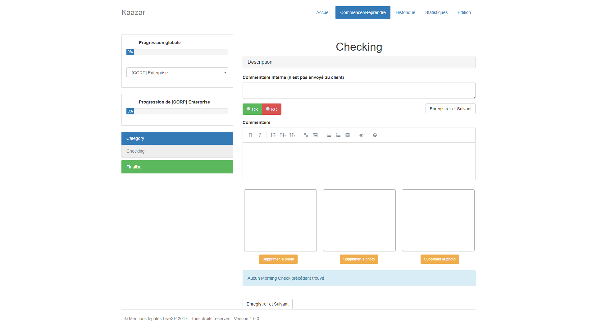
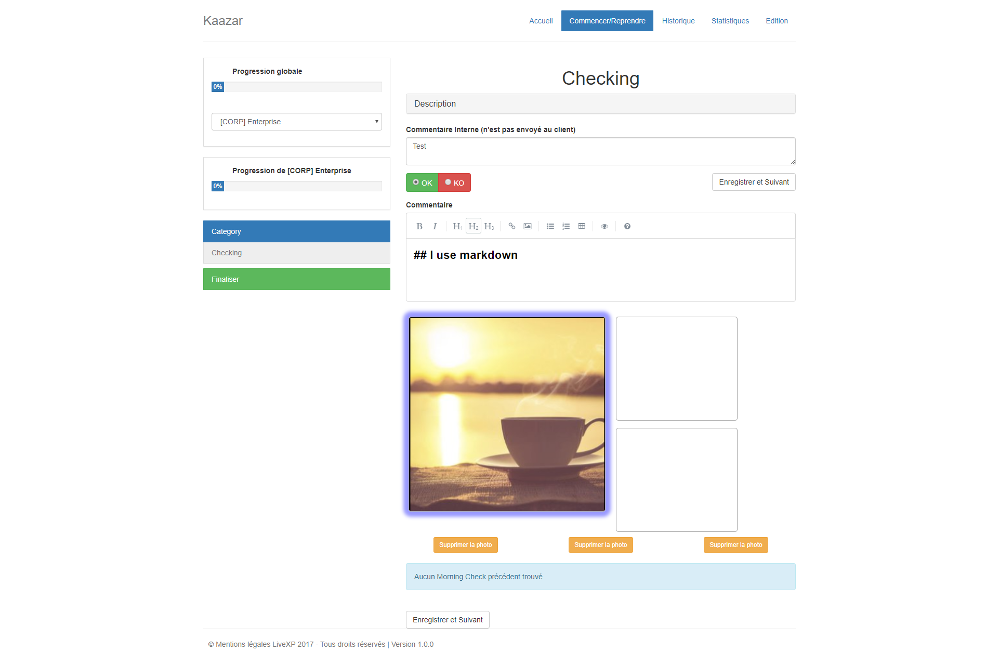
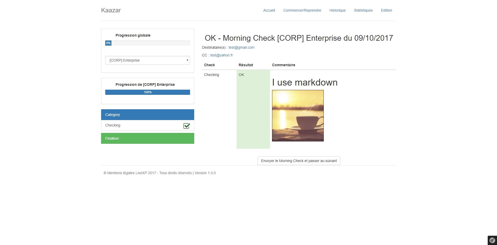
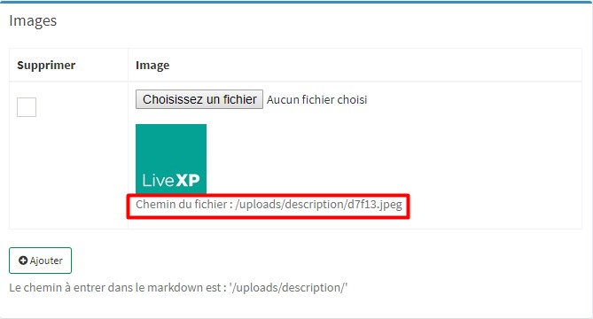

Kaazar
======

Kaazar is an internal LiveXP system used to simplify daily IT Morning Checks.

Features
--------
* Web Interface to run daily Check
  * Mark Down Editor
  * Ability to copy/past ScreenShot easyly
  * Send the result by email (if wanted)
* Organisation by project / customer
* Get a view on the daily global progression
* Get Statistic by month
* Consult the history by Check and/or Date
* Admin Web Interface for :
  * Create / edit a project and checks
  * Describe the content of the test
  * Define mailing list
  * Define occurence (daily/weekly/monthly)

### Screenshots

Page for executing a Check : 

To add images just copy them from a screenshot tool and paste them in the squares.

The field "Commentaire Interne" is a tip that will be printed in its box every day for the same Checking.
It is usefull if you want to pass some information like a todo or a not todo.

By clicking on an image square you can enlarge it

Once you filled all your Checking you will arrive to the final page where you will have a summary of all the current Morning Check Checkings,
and if the Morning Check have the email field enabled, its recipients and CC

Installation
------------

This Symfony application needs some steps to work. You may use Docker environment and follow those steps.

### Docker Compose

You can install the project with docker (docker compose). 

For more information about docker-compose check this [readme](./engine/README.md)

First you need to copy ``docker-compose.yml.dist`` to ``docker-compose.yml`` and update the mysql informations 

Then run ``docker-compose up`` to start the docker environment

You need to copy your own parameters.yml file.

~~~~~~~~~~~~~~~~~~~~~~~~~~~~~~~~~~~~~~~~~~~~~~~~~~~~~~~~~~~~~~~~~~~~~~~~~~~~~~~~
$ cp app/config/parameters.yml.dist app/config/parameters.yml
~~~~~~~~~~~~~~~~~~~~~~~~~~~~~~~~~~~~~~~~~~~~~~~~~~~~~~~~~~~~~~~~~~~~~~~~~~~~~~~~

After, you need to install composer dependencies.

~~~~~~~~~~~~~~~~~~~~~~~~~~~~~~~~~~~~~~~~~~~~~~~~~~~~~~~~~~~~~~~~~~~~~~~~~~~~~~~~
$ docker-compose exec php-fpm composer install
~~~~~~~~~~~~~~~~~~~~~~~~~~~~~~~~~~~~~~~~~~~~~~~~~~~~~~~~~~~~~~~~~~~~~~~~~~~~~~~~

#### MariaDB (MySQL)

~~~~~~~~~~~~~~~~~~~~~~~~~~~~~~~~~~~~~~~~~~~~~~~~~~~~~~~~~~~~~~~~~~~~~~~~~~~~~~~~
$ docker-compose exec php-fpm bin/console doctrine:schema:update --force
~~~~~~~~~~~~~~~~~~~~~~~~~~~~~~~~~~~~~~~~~~~~~~~~~~~~~~~~~~~~~~~~~~~~~~~~~~~~~~~~

Data for fixtures are available, if you wish to use them, you need to fill the files 
in [DataFixtures/Data](./src/AppBundle/DataFixtures/Data) with you own data and then load them

~~~~~~~~~~~~~~~~~~~~~~~~~~~~~~~~~~~~~~~~~~~~~~~~~~~~~~~~~~~~~~~~~~~~~~~~~~~~~~~~
$ docker-compose exec php-fpm bin/console doctrine:fixtures:load
~~~~~~~~~~~~~~~~~~~~~~~~~~~~~~~~~~~~~~~~~~~~~~~~~~~~~~~~~~~~~~~~~~~~~~~~~~~~~~~~

Assets
------

This project uses bower to install all the css and js ressources

~~~~~~~~~~~~~~~~~~~~~~~~~~~~~~~~~~~~~~~~~~~~~~~~~~~~~~~~~~~~~~~~~~~~~~~~~~~~~~~~
$ bower install
$ bower install ./vendor/sonata-project/admin-bundle/bower.json
$ docker-compose exec php-fpm bin/console assets:install --symlink web
$ docker-compose exec php-fpm bin/console assetic:dump
~~~~~~~~~~~~~~~~~~~~~~~~~~~~~~~~~~~~~~~~~~~~~~~~~~~~~~~~~~~~~~~~~~~~~~~~~~~~~~~~

#### Commands

This project use the following command to send emails, you may test with : 
~~~~~~~~~~~~~~~~~~~~~~~~~~~~~~~~~~~~~~~~~~~~~~~~~~~~~~~~~~~~~~~~~~~~~~~~~~~~~~~~
$ docker-compose exec php-fpm bin/console swiftmailer:spool:send --env=prod
~~~~~~~~~~~~~~~~~~~~~~~~~~~~~~~~~~~~~~~~~~~~~~~~~~~~~~~~~~~~~~~~~~~~~~~~~~~~~~~~

or better put it in a crontab to send email to a fixed interval :

#### Cronjobs

Add the following lines to your crontab, it will send mails every minute and close all MorningCheck every day at 23h (11PM)

~~~~~~~~~~~~~~~~~~~~~~~~~~~~~~~~~~~~~~~~~~~~~~~~~~~~~~~~~~~~~~~~~~~~~~~~~~~~~~~~
$ */1 *   * * *   root /usr/bin/docker-compose exec php-fpm bin/console swiftmailer:spool:send --env=prod
$ 0   23  * * *   root /usr/bin/docker-compose exec php-fpm bin/console morningcheck:close --env=prod
~~~~~~~~~~~~~~~~~~~~~~~~~~~~~~~~~~~~~~~~~~~~~~~~~~~~~~~~~~~~~~~~~~~~~~~~~~~~~~~~

Admin interface / Content edition
-----

You can create/update/delete your models in the admin interface (/admin/dashboard)

The MorningCheck and Checking Entities are created from their models every days, 
so if you edit a Model during the day you will see the changes on the MorningCheck/Checking the next day only.

You can disable a MorningCheckModel and a CheckingModel so that it will not created the next day.

You can define an occurence (daily/weekly/monthly) for a CheckingModel, 
so that it will be created only when needed (every day, every monday, every first of the month)

The CheckingModel Description field is a MarkDown editor, 
you can also include images that you uploaded on the right side of the CheckingModel admin edition page 
by writing the url wrote under the upload picture.

